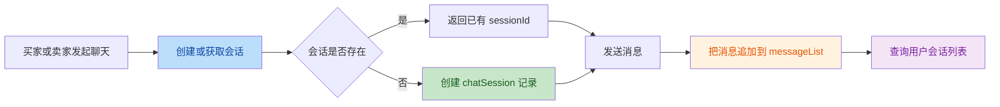
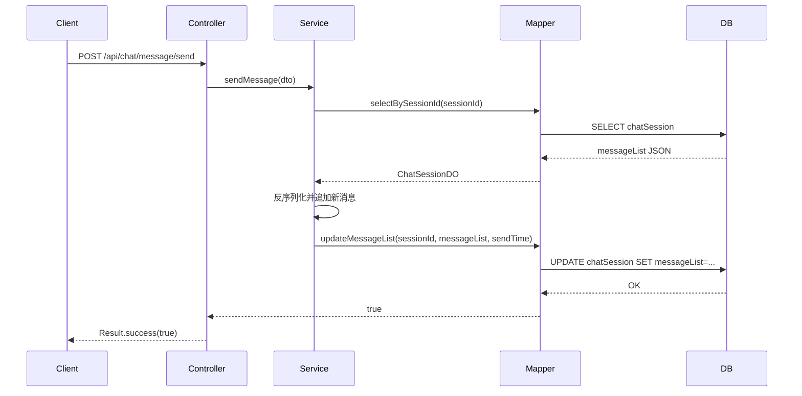

# `chat` Branch Code Review

## 审查范围

- 仓库：`boiler-jun-t`
- 分支：`chat`
- 主要审查范围：`8943d80..HEAD`
- 关键功能提交：`4c43fc8 chat聊天模块开发完成，会话创建/发消息/查询会话接口本地调试通过，不改动公共common返回规范`
- 补充提交：`01b835b`、`501e158` 主要调整本地数据库配置注释

## 作者意图

本次分支的核心目标是补齐一个最小可用的聊天模块，在现有 Spring Boot + MyBatis 工程中新增会话创建、消息发送、会话列表查询三类接口，并通过自定义 MyBatis `TypeHandler` 把聊天消息列表以 JSON 形式存入 `chatSession` 表。

## 这个分支做了什么

- 新增聊天控制器 `ChatSessionController`，暴露 3 个接口：
  - `POST /api/chat/session/create`
  - `POST /api/chat/message/send`
  - `GET /api/chat/session/list`
- 新增聊天领域对象：
  - `ChatSessionCreateDTO`
  - `ChatSendMsgDTO`
  - `ChatSessionDO`
  - `ChatSessionVO`
  - `MessageItem`
- 新增聊天服务层与 MyBatis Mapper：
  - `ChatSessionService`
  - `ChatSessionServiceImpl`
  - `ChatSessionMapper`
  - `ChatSessionMapper.xml`
- 新增 `JsonListTypeHandler`，将 `List<MessageItem>` 与数据库 JSON/TEXT 字段双向转换
- 修改 `boiler-common/pom.xml`，为公共模块引入 JSON 处理能力

## 实现方案

- 架构方案：沿用现有三层结构，`Controller -> Service -> Mapper`
- 数据方案：每个会话一条 `chatSession` 记录，消息列表整体保存在 `messageList` JSON 字段中
- 唯一性方案：以 `buyerId + sellerId + postId` 作为会话唯一键的业务约定
- 查询方案：通过 `(buyerId = userId OR sellerId = userId)` 查询用户全部未归档会话，并按 `lastMessageTime DESC` 排序
- 写入方案：发送消息时先读取整条会话，再把新消息追加到内存中的 `messageList`，最后整体更新回数据库

## 变更概览

**业务流程**

**技术流程**

## Review Findings

| No. | Issue Title | Suggestion | Code Link |
|-----|-------------|------------|-----------|
| 1 | 聊天接口直接信任前端传入身份，未校验调用者是否为会话参与者 | 不要让前端直接决定 `buyerId`、`sellerId`、`userId`、`senderId` 的有效性；应从登录态中获取当前用户，并在服务层校验该用户必须是会话参与者后才能创建、查询或发送消息。 | [ChatSessionController](file:///Users/wangchi/Documents/trae_projects/delme0704/boiler-jun-t/boiler-server/src/main/java/org/example/boilerserver/controller/ChatSessionController.java#L42-L70), [ChatSessionServiceImpl](file:///Users/wangchi/Documents/trae_projects/delme0704/boiler-jun-t/boiler-server/src/main/java/org/example/boilerserver/service/impl/ChatSessionServiceImpl.java#L76-L100), [WebMvcConfig](file:///Users/wangchi/Documents/trae_projects/delme0704/boiler-jun-t/boiler-server/src/main/java/org/example/boilerserver/config/WebMvcConfig.java#L20-L24) |
| 2 | `sendMessage` 采用“读整段 JSON -> 追加 -> 整体覆盖写回”，并发下会丢消息 | 如果继续保留 JSON 列方案，至少要引入版本号或悲观锁，确保更新时检测并发冲突；更稳妥的方案是改成消息明细表，单条消息 append-only 插入。 | [ChatSessionServiceImpl](file:///Users/wangchi/Documents/trae_projects/delme0704/boiler-jun-t/boiler-server/src/main/java/org/example/boilerserver/service/impl/ChatSessionServiceImpl.java#L76-L100), [ChatSessionMapper.xml](file:///Users/wangchi/Documents/trae_projects/delme0704/boiler-jun-t/boiler-server/src/main/resources/mapper/ChatSessionMapper.xml#L84-L88) |
| 3 | `messageList` JSON 解析失败时被吞掉并返回空列表，后续发送消息会覆盖掉历史记录 | 解析失败不应降级为空列表继续写回；应记录结构化日志并中止写操作，避免把“脏数据”误当作“空历史”覆盖到数据库。 | [JsonListTypeHandler](file:///Users/wangchi/Documents/trae_projects/delme0704/boiler-jun-t/boiler-common/src/main/java/org/example/boilercommon/JsonListTypeHandler.java#L65-L75), [ChatSessionServiceImpl](file:///Users/wangchi/Documents/trae_projects/delme0704/boiler-jun-t/boiler-server/src/main/java/org/example/boilerserver/service/impl/ChatSessionServiceImpl.java#L92-L100) |

## 问题说明

### 1. 身份与权限校验缺失

`/api/chat` 下的 3 个接口全部直接使用请求体或查询参数中的业务 ID。当前项目只对 `/user/admin/**` 走了管理员拦截器，而聊天接口完全没有接入登录态或参与者校验。结果是任意调用方都可以：

- 伪造 `buyerId/sellerId` 创建他人的会话
- 伪造 `userId` 拉取他人的会话列表
- 伪造 `senderId/senderType` 向任意 `sessionId` 发送消息

这不是单纯的“还没接鉴权”，而是当前接口契约本身就把权限边界交给了前端。

### 2. 并发发送消息会丢数据

`sendMessage()` 的写法是：

1. 先查整条会话
2. 把 `messageList` 反序列化到内存
3. 在内存里 `add(newMessage)`
4. 再把完整 JSON 整体 `UPDATE` 回去

如果两个请求同时发送消息，二者都可能基于同一份旧 `messageList` 生成新列表，后提交的事务会覆盖先提交的事务，最终只保留一条新增消息。`@Transactional` 不能解决这个问题，因为代码没有加锁，也没有版本校验。

### 3. 脏数据会被“自动修复”为丢历史

`JsonListTypeHandler` 在反序列化失败时直接返回空列表。这样一来，只要某条会话里的 `messageList` JSON 因历史脏数据或人工修库而损坏：

1. 查询时会得到一个空 `messageList`
2. `sendMessage()` 会在这个空列表上追加新消息
3. `updateMessageList()` 会把数据库里原本的整段历史直接覆盖成“仅剩新消息”

这会把原本尚可人工修复的数据破坏成不可恢复的数据损失。

## 测试与风险

- 已执行：`./mvnw test -q`
- 结果：通过
- 现状：仓库内没有聊天模块的针对性测试，本次通过更像是工程能启动/基础上下文测试通过，不能覆盖并发写入、权限边界、JSON 脏数据等关键场景

## 结论

`chat` 分支已经补齐了聊天模块的最小业务闭环，但当前实现属于“可本地演示”的第一版，而不是“可安全上线”的版本。它采用了开发成本较低的单表 + JSON 消息数组方案，能快速打通接口，但在权限边界、并发一致性和异常数据处理上都存在明显缺口。

如果后续要继续演进，建议优先处理：

1. 认证与会话参与者校验
2. 消息存储模型的并发一致性
3. 解析失败时的保护策略与专项测试
